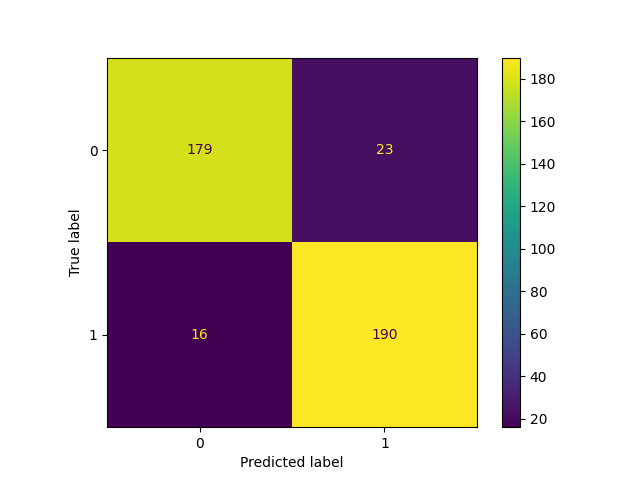
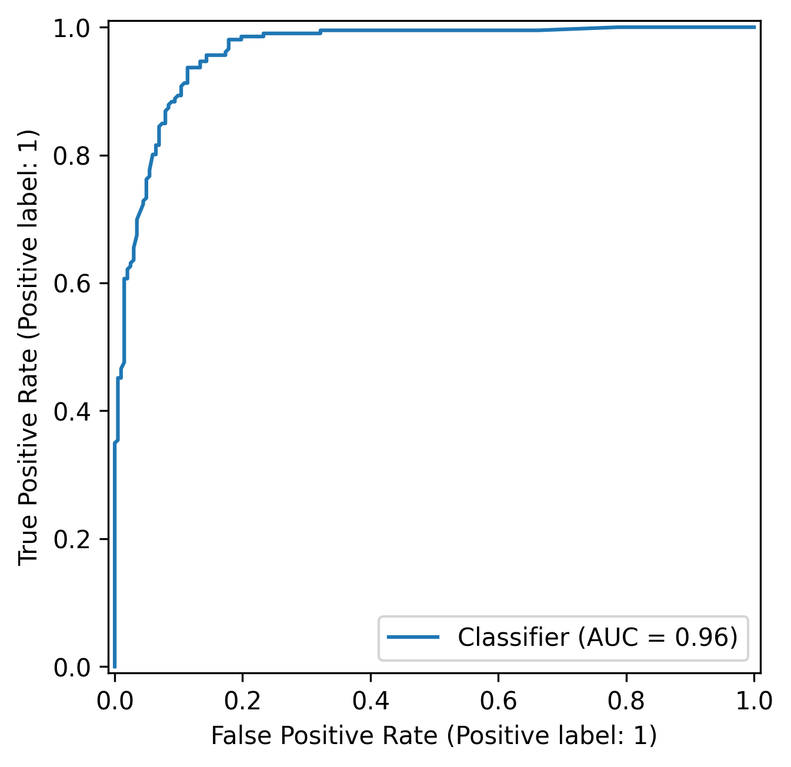

📌 Objetivo

Este projeto tem como objetivo prever a probabilidade de um cliente realizar compras com base em características demográficas e comportamentais, utilizando técnicas de Machine Learning.

A proposta é apoiar estratégias de marketing direcionado, aumentando a eficiência de campanhas e reduzindo custos operacionais.

________________________________________________________

📂 Dados

O dataset contém informações sobre:

Perfil do cliente (idade, renda)

Comportamento de consumo (gastos por categoria)

Interação com canais (visitas ao site, compras em loja)

Resposta a campanhas anteriores

______________________________________________________________________________

🔍 Etapas do Projeto
1. Limpeza de Dados

Remoção de valores inconsistentes (ex: outliers extremos em Income)

Tratamento de dados faltantes

2. Análise Exploratória (EDA)

Distribuição das variáveis

Análise de correlação

Verificação de multicolinearidade

Avaliação de balanceamento da variável alvo

3. Feature Engineering

Criação da variável Age

Teste da variável agregada Total_Spending

Avaliação do impacto de multicolinearidade

4. Separação dos Dados

Split treino/teste para evitar vazamento de dados

5. Modelagem
Baseline:

Logistic Regression

Validação cruzada

Modelo principal:

Random Forest

Melhor desempenho capturando relações não lineares

6. Otimização de Hiperparâmetros

RandomizedSearchCV

Ajuste de parâmetros como profundidade e número de árvores

7. Avaliação Final

Métricas utilizadas:

Accuracy

Precision, Recall, F1-score

Matriz de confusão

ROC AUC

📈 Resultados

Accuracy: ~0.90

AUC: 0.96

Alto desempenho na identificação de compradores

________________________________________________________________________________

📊 Principais Variáveis

MntWines

MntMeatProducts

NumStorePurchases

Income

NumWebVisitsMonth

____________________________________________________________________________________________________

🧠 Insights de Negócio

O comportamento passado de consumo é o principal preditor de compras futuras

Clientes que já consomem (especialmente vinhos e carnes) têm alta probabilidade de recompra

Engajamento digital (visitas ao site) também influencia decisões de compra

____________________________________________________________________________________________________

⚠️ Limitações

Forte dependência de variáveis de histórico de consumo

Possível inflação da performance devido a comportamento passado

Menor capacidade de prever novos clientes (cold start)

____________________________________________________________________________________________________

💡 Próximos Passos

Modelos sem variáveis de consumo para avaliar generalização

Uso de SHAP para interpretabilidade avançada

Ajuste de threshold para otimização de recall

______________________________________________________________________________________________________

Este projeto demonstra não apenas a construção de um modelo preditivo, mas também a preocupação com boas práticas de Machine Learning, como prevenção de vazamento de dados, validação robusta e interpretação dos resultados.

Além disso, a análise crítica sobre o comportamento do modelo e suas limitações reforça a importância de alinhar soluções de dados com o contexto de negócio.
